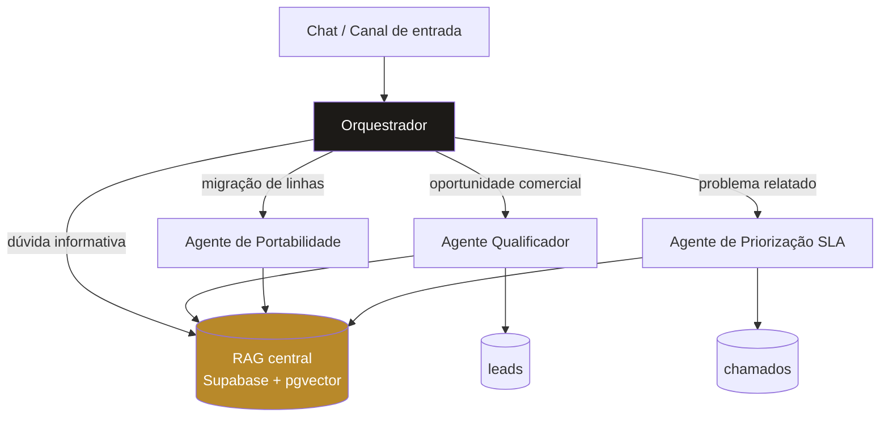

# Agente de Pré-Vendas e Portabilidade B2B — Telecom

Sistema multiagente de atendimento comercial para consultoria B2B em telecom, construído em n8n com RAG central em Supabase.

Projeto de portfólio desenvolvido a partir do contexto público de operação de uma consultoria B2B de telecom: carteira na casa dos milhares de clientes empresariais, SLA diferenciado por tier de contrato e processo recorrente de portabilidade de linhas. **Todos os dados de planos, preços e políticas neste repositório são fictícios**, criados para demonstrar a arquitetura sem expor informação de nenhuma empresa real.

---

## O problema de negócio

Uma consultoria B2B de telecom concentra três fluxos de trabalho distintos no mesmo canal de entrada:

1. **Pré-venda** — leads que chegam pedindo proposta, com volume de linhas e necessidades muito diferentes entre si
2. **Portabilidade** — clientes já fechados que precisam ser conduzidos por um processo burocrático de várias etapas
3. **Suporte** — clientes ativos relatando problemas que precisam ser classificados por impacto e roteados dentro do SLA contratado

Os três chegam pelo mesmo WhatsApp, para as mesmas pessoas. O custo disso é conhecido: lead qualificado esperando enquanto alguém explica documentação de portabilidade, e chamado crítico de cliente de tier alto na mesma fila de uma dúvida de fatura.

O sistema resolve o roteamento e a primeira camada de cada fluxo, entregando ao humano o caso já estruturado.

---

## Arquitetura



### Orquestrador

Não resolve nenhum caso. Sua única responsabilidade é entender a intenção e acionar o especialista correto, mantendo a continuidade da conversa através de memória de janela.

Regra de desempate implementada: se a empresa já é cliente, é chamado; se está avaliando contratar, é lead. Portabilidade sempre vai para o agente dedicado, mesmo quando surge dentro de uma conversa comercial.

### Agente Qualificador

Recebe o texto acumulado da conversa e devolve um dossiê estruturado. Aplica uma **rubrica de score fixa e auditável** — volume de linhas, senioridade do contato, dor explícita com a operadora atual, prazo declarado — e classifica temperatura por faixa.

Consulta o RAG para sugerir plano. Grava em `leads`.

### Agente de Portabilidade

Conduz o processo etapa por etapa, sem despejar o fluxo inteiro de uma vez. Prazos, documentos e janelas de migração vêm exclusivamente do RAG.

Levanta proativamente os pontos que travam portabilidade na prática: pendência financeira na operadora de origem, divergência de titularidade do CNPJ, multa rescisória por fidelidade.

### Agente de Priorização SLA

Classifica categoria e urgência, define o SLA aplicável ao tier e encaminha ao time correto. Grava em `chamados`.

O critério de urgência é **impacto operacional, não tom do cliente** — decisão deliberada: cliente irritado não escala prioridade, operação parada escala. A irritação é registrada na descrição, não no score.

---

## Decisões técnicas

### Orquestrador + especialistas, não três fluxos independentes

Três fluxos soltos exigiriam que o usuário soubesse de antemão com quem falar. A camada de orquestração absorve essa decisão.

O ganho estrutural é outro: cada especialista é uma unidade isolada, com prompt próprio e testável sozinho. Adicionar um quarto agente não exige tocar em nenhum dos três existentes — só registrar mais uma ferramenta no orquestrador.

### Rubrica de score em regra fixa, não a critério do modelo

O score poderia ser deixado a cargo do LLM. Não foi. A rubrica está escrita como soma de pontos com faixas explícitas, porque score de lead precisa ser **reproduzível e defensável** diante do time comercial. Um número que muda entre execuções idênticas não sustenta priorização de carteira.

### Nó único de normalização por agente

Toda saída de LLM que precisa virar registro estruturado passa por um único nó de parsing, com fallback explícito quando o JSON vem malformado.

Qualquer mudança de comportamento do modelo fica contida nesse ponto, sem contaminar o resto do fluxo. É o mesmo princípio de isolar dependência externa em uma camada só.

### RAG como fonte única de verdade

Nenhum agente cita plano, preço, prazo ou SLA de memória. Todos consultam a mesma base vetorial. Quando a base não cobre o caso, a instrução é declarar isso e escalar — não improvisar.

Em contexto comercial, um preço inventado é pior que uma resposta ausente.

### Temperatura calibrada por função

Classificação de chamado em 0.1, extração de lead em 0.2, portabilidade em 0.3, orquestração em 0.4. Tarefa de classificação precisa de consistência; condução de conversa precisa de alguma naturalidade.

---

## Stack

| Camada | Tecnologia |
|---|---|
| Orquestração | n8n |
| Modelo de linguagem | Google Gemini (Flash-Lite) |
| Embeddings | Gemini Embedding |
| Banco + vetorial | Supabase (PostgreSQL + pgvector) |
| Interface de teste | Chat Trigger nativo do n8n |

### Sobre a escolha do Gemini

Escolha de custo, não de capacidade. O Gemini resolve chat e embeddings com uma única credencial em tier gratuito, o que mantém este projeto reproduzível por qualquer pessoa que clone o repositório sem precisar de cartão de crédito.

A arquitetura é agnóstica ao provedor: trocar o nó de modelo por Claude ou OpenAI não altera nenhuma outra parte do sistema. Em projeto comercial anterior, a mesma arquitetura de agentes foi especificada sobre a API da Anthropic.

### Interface de teste em vez de WhatsApp

O Chat Trigger nativo do n8n demonstra o comportamento completo do sistema sem custo de gateway. A integração com WhatsApp Business seria a troca de um único nó de entrada.

---

## Notas de implementação

Dois pontos que consumiram tempo real de depuração e valem registro:

**Dimensionalidade de embeddings.** Os modelos legados de embedding do Google foram descontinuados. Requisições ao alias antigo passaram a ser servidas pelo modelo atual, que retorna 3072 dimensões por padrão em vez das 768 esperadas — sem erro de modelo, só falha de insert no banco. A correção exigiu alinhar a coluna `vector` e a assinatura da função de busca.

Consequência arquitetural: pgvector não suporta índice acima de 2000 dimensões. Nesta escala a busca sequencial é irrelevante, mas em produção a decisão seria truncar para 768 via `output_dimensionality` — com atenção à normalização, que é automática em alguns modelos da família e manual em outros.

**Sub-workflow precisa ser workflow separado e publicado.** O nó de chamada resolve por ID de workflow. Agentes no mesmo canvas não são endereçáveis como ferramenta.

---

## Estrutura do repositório

```
workflows/
  00_Ingestao_RAG.json     ingestão da base de conhecimento no RAG
  01_Orquestrador.json     roteamento e interface de chat
  02_Qualificador.json     qualificação de leads e score
  03_Portabilidade.json    condução do processo de portabilidade
  04_SLA.json              classificação de chamados e SLA
sql/
  schema.sql               tabelas, função de busca e permissões
docs/
  base_conhecimento_ficticia.md
```

## Como reproduzir

1. Criar projeto no Supabase e rodar `sql/schema.sql` inteiro no SQL Editor
2. Criar credenciais de Google Gemini e Supabase (chave `service_role`) no n8n
3. Importar os cinco workflows — **cada um como um workflow separado**, não no mesmo canvas
4. Subir `docs/base_conhecimento_ficticia.md` para o Google Drive e selecioná-lo no nó Google Drive do `00_Ingestao_RAG`
5. Anexar as credenciais em todos os nós marcados com `CONFIGURAR` nas notas
6. Executar `00_Ingestao_RAG` e validar com `select count(*), vector_dims(embedding) from documents group by 2;`
7. Publicar os três sub-workflows (02, 03 e 04) — o n8n exige que estejam publicados para serem chamados como ferramenta
8. No orquestrador, selecionar cada sub-workflow pela lista nos três nós `Tool`
9. Abrir o chat do nó `Chat` e testar

### Roteiro de teste

| Mensagem | Comportamento esperado |
|---|---|
| "Sou o Marcos, diretor da Almeida Logística. Temos 35 linhas na operadora atual, o suporte demora dias e nosso contrato vence em novembro." | Aciona o Qualificador, grava em `leads` com score 80 e temperatura quente |
| "Qual plano vocês recomendam?" | Consulta o RAG e sugere o Plano Corporativo |
| "Já fechamos. O que preciso para migrar as linhas?" | Roteia para Portabilidade, não volta ao Qualificador |
| "Aqui é da Platinum Móveis, cliente Platinum. Todas as linhas caíram há duas horas." | Classifica como crítico, encaminha a N2, grava em `chamados` |

---

## Limitações conhecidas

- Base de conhecimento reduzida, suficiente para demonstrar o padrão de retrieval, não para cobertura real de catálogo
- Sem tratamento de concorrência: dois atendimentos simultâneos do mesmo cliente podem gerar registros duplicados
- Modelo em tier gratuito tem limite de requisições por minuto que restringe volume simultâneo
- Sem camada de avaliação automatizada da qualidade das classificações

---

**Rodrigo Teixeira Ferreira**
Engenheiro de Automação e Agentes de IA
